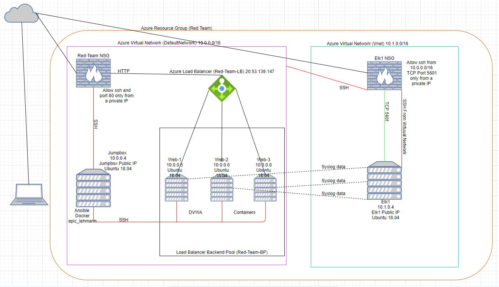
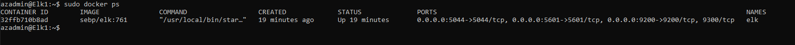

### Automated ELK Stack Deployment

The files in this repository were used to configure the network depicted below.

These files have been tested and used to generate a live ELK deployment on Azure. They can be used to either recreate the entire deployment pictured above. Alternatively, select portions of the .yml file may be used to install only certain pieces of it, such as Filebeat.

  - The Ansible playbooks required to recreate the Elk server are [install_elk.yml](Ansible/roles/install-elk.yml) and [filebeat-playbook.yml](Ansible/roles/filebeat-playbook.yml)
  
  Note: [install_elk.yml](Ansible/roles/install-elk.yml) requires line 4 to reflect the username that has admin rights to install software on the elk server.
  Filebeat requires a [filebeat-config.yml](Ansible/roles/files/filebeat-config.yml) file. The [filebeat-playbook.yml](Ansible/roles/filebeat-playbook.yml) will need to reflect the correct path of the [filebeat-config.yml](Ansible/roles/files/filebeat-config.yml) file on line 17. You will also need to alter lines 1105 to 1107 to reflect the Elk server IP and the username and password, as well as Line 1805 to have the correct IP

This document contains the following details:
- Description of the Topologu
- Access Policies
- ELK Configuration
  - Beats in Use
  - Machines Being Monitored
- How to Use the Ansible Build

### Description of the Topology

The main purpose of this network is to expose a load-balanced and monitored instance of DVWA, the D*mn Vulnerable Web Application.

Load balancing ensures that the application will be highly available, in addition to restricting access to the network.
- Load Balancers are an aspect of the Availabilty part of the CIA triad, by increasing the availablity of a resource.
 - A Jumpbox allows an organisation to restrict administrative tasks to only come in from one connection adding another layer of security, this is the confidentiality aspect of the CIA triad.

Integrating an ELK server allows users to easily monitor the vulnerable VMs for changes to the _____ and system _____.
- Filebeat watches for log files in location that have been specified and monitors anmd records the changes.
- Metricbeat monitors servers by collecting metrics from the system and services running on the server.

The configuration details of each machine may be found below.
_Note: Use the [Markdown Table Generator](http://www.tablesgenerator.com/markdown_tables) to add/remove values from the table_.

| Name     | Function    | IP Address | Operating System   |
|----------|----------   |------------|------------------  |
| Jump Box | Gateway     | 10.0.0.4   | Linux Ubuntu 18.04 |
| Web-1    | Docker-DVWA | 10.0.0.5   | Linux Ubuntu 18.04 |
| Web-2    | Docker-DVWA | 10.0.0.6   | Linux Ubuntu 18.04 |
| Web-3    | Docker-DVWA | 10.0.0.8   | Linux Ubuntu 18.04 |
| Elk1     | Elk stack   | 10.1.0.4   | Linux Ubuntu 18.04 |  

### Access Policies

The machines on the internal network are not exposed to the public Internet. 

Only the Jumpbox machine can accept connections from the Internet. Access to this machine is only allowed from the following IP addresses:
- A specified IP address

Machines within the network can only be accessed by ssh.
- The Elk server can only be reached via ssh @ 10.1.0.4 from the jumpbox on 10.0.0.4 or on TCP port 5601 from a specified IP address

A summary of the access policies in place can be found in the table below.

| Name     | Publicly Accessible | Allowed IP Addresses                                                    |
|----------|---------------------|-------------------------------------------------------------------------|
| JumpBox  |    No               | A Specified IP address Only                                             |
| Web-1    |    No               | Jumpbox 10.0.0.4 for SSH & A Specified IP address Only for TCP Port 80  |
| Web-2    |    No               | Jumpbox 10.0.0.4 for SSH & A Specified IP address Only for TCP Port 80  |
| Web-3    |    No               | Jumpbox 10.0.0.4 for SSH & A Specified IP address Only for TCP Port 80  |
| Elk1     |    No               | Jumpbox 10.0.0.4 for SSH & A Specified IP address Only for TCP Port 5601|

### Elk Configuration

Ansible was used to automate configuration of the ELK machine. No configuration was performed manually, which is advantageous because it makes the deployment very easy and scalable, instead of needing to connect and configure each server individually, servers can be configured by one set of scripts running on ansible and deployed to all servers at once.

The playbook implements the following tasks:
- Install docker.io and pip3
- install docker module for pip
- increase the virtual memory 
- Download and laucnch the elk container 
- Enable the docker service on boot

The following screenshot displays the result of running `docker ps` after successfully configuring the ELK instance.

### Target Machines & Beats
This ELK server is configured to monitor the following machines:
- 10.0.0.5, 10.0.0.6 and 10.0.0.8

We have installed the following Beats on these machines:
- Filebeats 7.6.1 and Metricbeat 7.4.0

These Beats allow us to collect the following information from each machine:
- Filebeat is a lightweight shipper for forwarding and centralizing log data. Filebeat monitors log files in locations you specify, collects log events, and forwards them either to Elasticsearch for indexing.
- Metricbeat collects metrics from the operating system and from services running on the server.

### Using the Playbook
In order to use the playbook, you will need to have an Ansible control node already configured. Assuming you have such a control node provisioned: 

SSH into the control node and follow the steps below:
- Copy the [filebeat-config.yml](Ansible/roles/files/filebeat-config.yml) file to /etc/ansible/roles/files/.
- Update the [filebeat-config.yml](Ansible/roles/files/filebeat-config.yml) file to include the Private IP of the Elk-Server to
  the ElasticSearch and Kibana sections of the configuration file.
- Run the playbook, and navigate to ELk-Server to check that the installation worked as expected.

_TODO: Answer the following questions to fill in the blanks:_
- [filebeat-playbook.yml](Ansible/roles/filebeat-playbook.yml) is copied to /etc/ansible/roles and [filebeat-config.yml](Ansible/roles/files/filebeat-config.yml) to /etc/ansible/roles/files/
- To run the Ansible playbook on a particular machine the /etc/ansible/hosts file will need to be edited to add the machine to the group you are running the playbook on. 
- By using differendt groups in the /etc/ansible/hosts file to store the IP addresses of different machines you could issue a command to run a playbook on the elk servers or install filebeat on the Web servers group (ie ansible-playbook install-elk.yml or ansible playbook filebeats-playbook.yml)
- To confirm if the Elk server is running you need to surf to the public IP of the webserver on port 5601 from the allowed specified IP.
If you havve allowed IP 1.2.3.4 to access the server at public address 5.6.7.8 then you would surf to 5.6.7.8:5601

To install the Elk server, filebeat and metricbeat you will need to perform the following tasks
- SSH to the jumpbox
- sudo docker container list -a (to list the containers and to locate the ansible container)
- sudo docker start "container-name"
- sudo docker attach "container-name"
- ensure you have placed your playbooks in /etc/ansible/roles
- place your config files in /etc/ansible/roles/files
- edit your /etc/ansible/ansible.cfg as per instructions above
- edit your /etc/ansible/hosts file to include your elk server under the [elk] entries in the hosts file
- edit your /etc/ansible/hosts file to include your web server under the [webservers] entries in the hosts file
- run sudo ansible-playbook /etc/ansible/roles/install-elk.yml and wait a few minutes for the task to complete.
- run sudo ansible-playbook /etc/ansible/roles/filebeat-playbook.yml and wait a few minutes for the task to complete.
- run sudo ansible-playbook /etc/ansible/roles/metricbeat-playbook.yml and wait a few minutes for the task to complete.
Open a web browser from the allowed IP address and surfv to "Elk Server Public IP":5601 to see the kibana  poirtal pages.